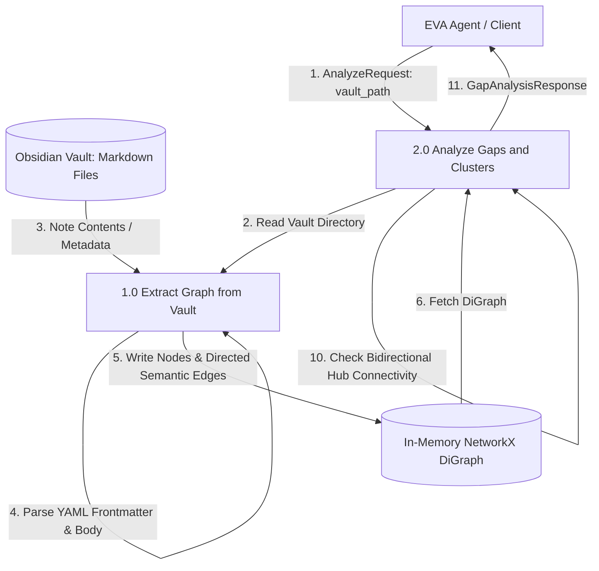

# FLOW — GKS Semantic Graph Analysis DFD

## Flow Diagram

## Sequence

1. **Request Initiation**: The `EVA Agent / Client` calls the FastAPI endpoint `/api/v1/analyze-gaps` with `vault_path`.
2. **Graph Extraction**:
   - The endpoint invokes `extract_graph_from_vault(vault_path)`.
   - The parser walks the vault directory, reading each Markdown file.
   - It extracts YAML Frontmatter keys: `related_to`, `contradicts`, `expands_on`, `depends_on`, `references` and registers them as directed edges in a `nx.DiGraph`.
   - It parses note bodies for standard Wikilinks (`[[NoteName]]`), registering them as default `related_to` edges.
3. **Graph Analysis**:
   - The endpoint calls NetworkX algorithms on the extracted graph.
   - An undirected copy of the graph (`G_undirected`) is generated.
   - Isolates (orphans) are extracted from the main graph.
   - Connected components (islands) are calculated on `G_undirected`.
   - Communities/clusters are detected using Greedy Modularity on `G_undirected`.
   - Centrality metrics are computed on the directed graph `G` to identify the primary `hub` node for each community.
   - Gaps/bridges are identified by checking whether there is any edge between community hubs using `G_undirected.has_edge(hub1, hub2)`.
4. **Response Delivery**: The endpoint compiles the results and sends a `GapAnalysisResponse` back to the `EVA Agent`.

## Source
- `[[FEAT--GKS-SEMANTIC-GRAPH-ANALYSIS]]`
- `[[ADR--GKS-SEMANTIC-GRAPH-ANALYSIS]]`
