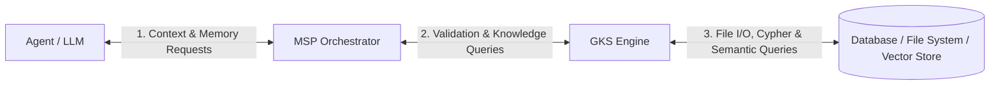
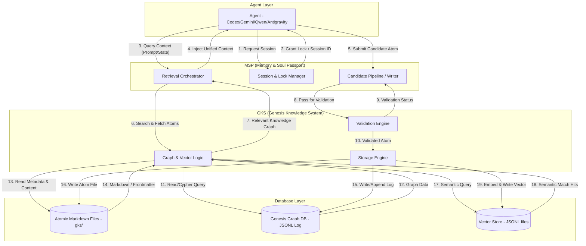

# FLOW — System Architecture DFD (Agent-MSP-GKS-DB)

## Flow Diagram

### Level 0: Context Diagram

### Level 1: Data Flow Diagram

## Sequence

1. **Session & Lock Initialization**:
   - An `Agent` starts a new task and requests session/concurrency lock initialization from `Session & Lock Manager (MSP)`.
   - The lock is granted, returning a session key to prevent write conflicts during execution.
2. **Context Retrieval**:
   - The `Agent` sends the current execution state/prompt to the `Retrieval Orchestrator (MSP)`.
   - The `Retrieval Orchestrator` sends search requests to the `GKS Graph & Vector Logic`.
   - `GKS` reads note files (`gks/` folder) and queries the local `Genesis Graph DB` log to assemble the relevant graph neighborhood.
   - `GKS` resolves wikilinks and constraints, returning structured knowledge back to `Retrieval Orchestrator`.
   - `Retrieval Orchestrator` compiles this into a unified context payload and injects it back to the `Agent`.
3. **Memory Proposal & Commit**:
   - As the `Agent` completes work, it proposes new or modified knowledge (e.g., `CONCEPT`, `ADR`, `BLUEPRINT` atoms) via the `Candidate Pipeline (MSP)`.
   - The candidate is passed to the `GKS Validation Engine` to check schemas (such as `atom_schema.yaml`) and link integrity.
   - If validation passes, the `GKS Storage Engine` writes the markdown file to `gks/` and appends a transaction log entry to `Genesis Graph DB`.
   - The `Candidate Pipeline` responds to the `Agent` with success.

## Source
- `[[FRAMEWORK--MSP-ARCHITECTURE-V2]]`
- `[[FRAMEWORK--FOUR-LAYERS]]`
