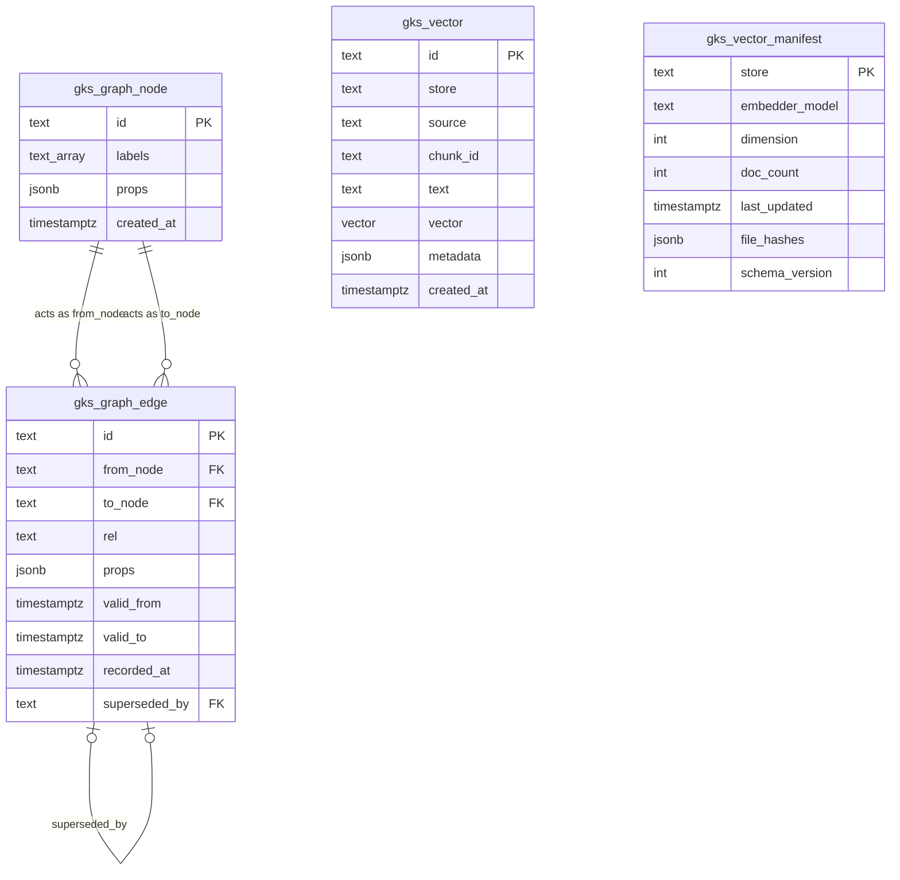

# ENTITY — SQL Database Schema (Graph & Vector) ERD

## Schema definition

### 1. Graph Tables (gks_graph)

#### Table: `gks_graph_node`
Stores the vertices (symbols, files, and framework entities).
* `id` (text, Primary Key): Unique identifier of the node.
* `labels` (text[]): Array of labels associated with the node (e.g., `Symbol`, `File`, `Concept`).
* `props` (jsonb): Dynamic properties payload.
* `created_at` (timestamptz): Node insertion timestamp.

#### Table: `gks_graph_edge`
Stores directed edges and bi-temporal relationship states.
* `id` (text, Primary Key): Unique edge identifier.
* `from_node` (text, Foreign Key): Referencing `gks_graph_node.id` (Source).
* `to_node` (text, Foreign Key): Referencing `gks_graph_node.id` (Target).
* `rel` (text): Relationship type (e.g., `Calls`, `Imports`, `Inherits`).
* `props` (jsonb): Dynamic properties.
* `valid_from` (timestamptz): Lower bound of valid time range.
* `valid_to` (timestamptz, Nullable): Upper bound of valid time range (NULL if currently active).
* `recorded_at` (timestamptz): System write time.
* `superseded_by` (text, Foreign Key): Self-reference to `gks_graph_edge.id` to track logical updates.

---

### 2. Vector Tables (gks_vector)

#### Table: `gks_vector`
Stores embedded document chunks for semantic search.
* `id` (text, Primary Key): Document/chunk unique identifier.
* `store` (text): Namespace partition identifier (e.g., `atomic`, `episodic`).
* `source` (text): Origin file path or URI.
* `chunk_id` (text): Parent document's chunk grouping key.
* `text` (text): Raw text contents.
* `vector` (vector(dim)): The high-dimensional float array embedding.
* `metadata` (jsonb): Filterable attributes (e.g., `tenant_id`, `session_id`).
* `created_at` (timestamptz): Time of insertion.

#### Table: `gks_vector_manifest`
Stores metadata configuration per logical store.
* `store` (text, Primary Key): Store namespace identifier.
* `embedder_model` (text): Embedding model used.
* `dimension` (int): Dimension of the embedding vectors.
* `doc_count` (int): Number of document rows in the store.
* `last_updated` (timestamptz): Time of the last store update.
* `file_hashes` (jsonb): Source file path to MD5 hash mappings.
* `schema_version` (int): Internal schema compatibility version.

## Relations

## Source
- `[[SPEC--GENESIS-GRAPH-BACKEND]]`
