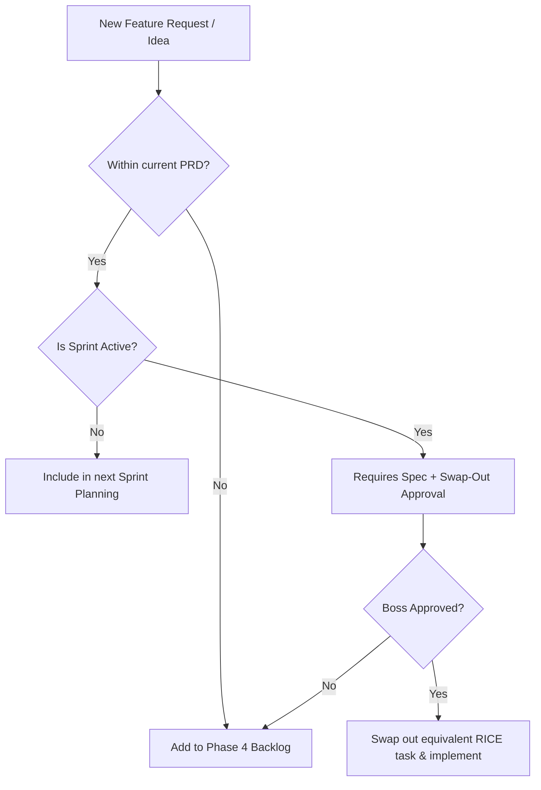

# FRAMEWORK — Scope Creep Prevention

## Intent

To prevent undocumented, unapproved, or dynamic scope expansion during active sprints. This framework establishes rules that enforce fixed sprint capacity and require technical specifications before code modification.

## Core Directives

### 1. No Spec, No Code (The DDD Gate)
No developer or AI agent is permitted to write or modify application code without an approved, corresponding technical specification or ADR inside the `docs/` or `gks/` directories. Any code change must map directly to a documented requirement.

### 2. Sprint Capacity Swap-Out
The capacity (Effort) of an active sprint is strictly timeboxed. If a critical new feature must be introduced mid-sprint:
- The team must estimate its Effort in person-days.
- An existing task of equivalent or greater Effort must be **removed** (swapped out) and returned to the backlog.
- Sprints must never grow in capacity post-sprint planning.

### 3. Backlog Partitioning (Won't Have Bin)
All feature ideas or optimization suggestions raised during a sprint that are not in the current sprint scope must be recorded as "Phase 4 - Backlog" items. Under no circumstances should they be implemented as part of the current active work.

### 4. Definition of Done (DoD) Verification
Tasks are only marked `done` when they pass the acceptance criteria specified in the original design docs/specs. Additional unrequested features (gold plating) are treated as violations and must be removed.

## Decision Flow

## Connections

- [[FRAMEWORK--PHASE-GOVERNANCE]]
- [[FRAMEWORK--AUTHORITY-MATRIX]]
- [[FRAMEWORK--MOSCOW-METHOD]]
- [[FRAMEWORK--RICE-SCORING]]
