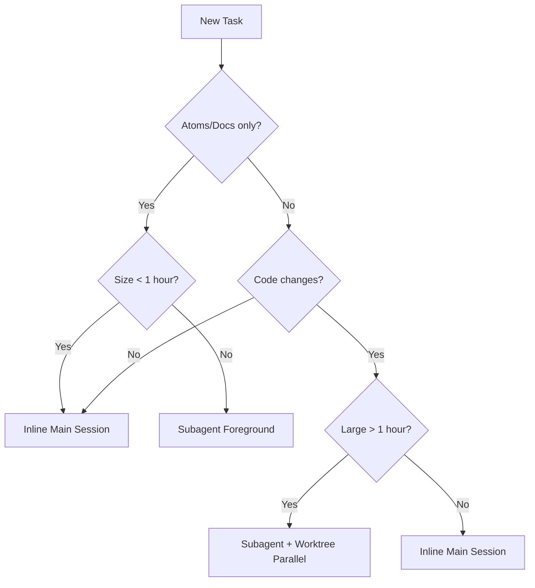

# Contributing to MSP

This guide outlines the workflow and rules for contributing to the Memory & Soul Passport (MSP) project. We follow a strict **Doc-to-Code** discipline to ensure the knowledge system and implementation stay in sync.

## Branch & Worktree Rules (Rules of Thumb)

### Basic Rules (from CLAUDE.md)
- **1 Milestone = 1 Branch**: Name format `claude/msp-<milestone>-<slug>-<harness-id>` (e.g., `claude/msp-m7c-retrieval-D76og`).
- **Base on latest main**: Always branch from the latest `main`. Avoid stacking branches unless strictly necessary.
- **Draft PRs**: Open PRs as `draft` immediately. Mark as `ready for review` only when CI is green.
- **Squash & Cleanup**: Use squash-merge and delete branches immediately after merging.

## Decision Tree: Workflow Selection

When starting a new task, use this logic to decide the execution method:

### Examples
| Task | Size | Method | Rationale |
| :--- | :--- | :--- | :--- |
| **Phase A** (delete 3 docs + add 4 atoms) | Small | Inline Main | Small, sequential tasks. |
| **Phase B Impl** (~3-5 days code, 8 src + 3 test) | Large | Subagent + Worktree | Parallel, isolated, keeps main clean. |
| **Phase C Docs** (~30 min, atoms+docs) | Medium | Subagent + Worktree | Parallel with Phase B work. |
| **Polish** (4 docs + 1 atom) | Medium | Inline Main | Sequential, requires iterative fixing. |
| **Audit/Cherry-pick** (1 atom) | Trivial | Inline Main | Trivial change. |

## Worktree Gotchas
- **No `node_modules/`**: Sub-agent worktrees must run `npm ci` before any tests (adds ~30s but prevents false negatives).
- **Cleanup**: If a worktree is locked after an agent finishes, use `git worktree remove -f -f <path>`.
- **CI is Source of Truth**: Environmental differences might cause local worktree tests to fail. Trust GitHub Actions.
- **Manual Branch Deletion**: Removing a worktree does not delete the branch. Run `git branch -D <name>` manually after cleanup.

## Naming Conventions
- **Topic milestones**: `claude/msp-<milestone>-<slug>-<id>`
- **Audit/Cherry-picks**: `claude/msp-<purpose>-<id>`
- **Pattern**: Append a harness ID (e.g., `-D76og`) to avoid collisions between multiple sessions or agents.

## Sequencing Rule (Crucial)
1. **Atoms PR First**: Create and merge the CONCEPT/ADR/FEAT/BLUEPRINT atoms first.
    - *Rationale*: Atoms define the contract. Reviewers can validate the design before code is written.
2. **Implementation PR Second**: Create a new branch for code implementation based on the merged atoms in `main`.

## Tools for AI Agents (Claude Code / Antigravity / Gemini)
- **Agent tool with `isolation: "worktree"`**: Automatically manages worktree lifecycle.
- **Background Subagent (`run_in_background: true`)**: For long tasks (>30 min) that allow the human to continue working.
- **Gemini CLI Subagent**: Use for boilerplate coding automation to save Claude's quota.
    - Command: `gemini -p "<prompt>" -y`
    - Use case: Unit test scaffolding, simple refactors, repetitive documentation.
- **Qwen CLI (Local)**: Use for microtasks via Ollama to save quota.
    - Command: `python G:\qwen-cli\qwen.py "prompt"`
    - Use case: Code explanation, single-function generation, regex patterns.
- **Foreground Subagent**: For research, lookups, or quick generation tasks that require immediate review.

## Verification Checklist
Before marking a PR as ready:
- [ ] Run `npm run msp:check-links`
- [ ] Run `npx tsx src/validator/cli.ts --all`
- [ ] Ensure all atoms have reciprocal supersession (if applicable) per `CLAUDE.md`
- [ ] Verify `npm test` passes
