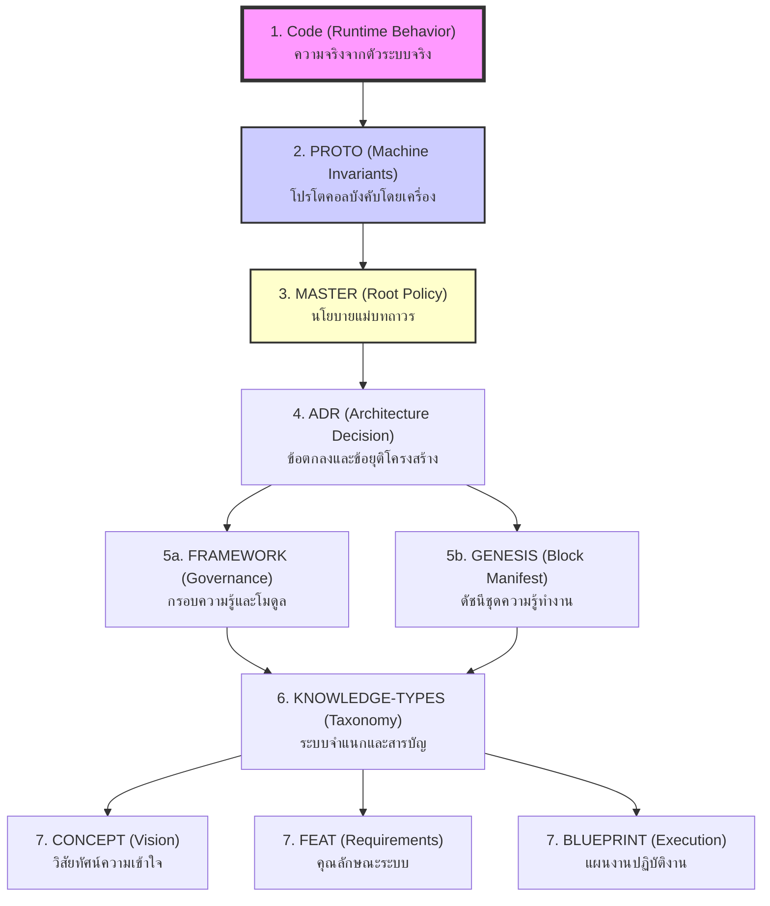
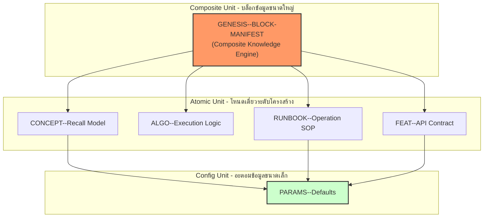
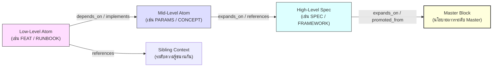

# GKS Knowledge Hierarchy and Single Source of Truth (SSOT) Standard

## Document Information
* **Status:** Stable
* **Last Updated:** 2026-05-29T04:08:00+07:00
* **Owner:** Technical Architect (Gemini-T2 / อาหวัง)
* **Path:** `docs/gks/KNOWLEDGE-HIERARCHY-AND-SSOT.md`
* **Domain:** System Governance & Epistemology

---

## 1. Overview (ภาพรวม)

ในสถาปัตยกรรม Genesis Knowledge System (GKS) ข้อมูลความรู้ถูกจัดเก็บและสืบค้นในรูปแบบของกราฟความสัมพันธ์ (Graph of Atoms) เพื่อหลีกเลี่ยงข้อขัดแย้งของข้อมูล (Contradiction) และเพิ่มประสิทธิภาพในการดึงข้อมูลเข้าระบบความคิดของ AI Agent เอกสารฉบับนี้จึงกำหนดมาตรฐานความสัมพันธ์ในสองมิติหลัก:
1. **SSOT Authority Hierarchy:** ลำดับสิทธิ์และความใหญ่ในการปกครองความจริงเมื่อเกิดข้อมูลขัดแย้งกัน
2. **Compositional Hierarchy:** ลำดับขนาดของขอบเขตข้อมูลและการรวมกลุ่มของ Node เพื่อการจัดการทรัพยากรระบบ

---

## 2. SSOT Authority Hierarchy (ลำดับการตัดสินความจริงสูงสุด)

หากเกิดกรณีความขัดแย้งทางเนื้อหา (Semantic Conflict) ระหว่างเอกสารตั้งแต่สองฉบับขึ้นไป ระบบจะประเมินหาแหล่งข้อมูลหลักที่น่าเชื่อถือที่สุดตามลำดับสิทธิ์ (Authority Order) จาก **สิทธิ์สูงสุด (High-Level / บังคับใช้ที่ระดับ Runtime)** ไปยัง **สิทธิ์ต่ำสุด (Low-Level / รายละเอียดแนวคิด)** ตามที่นิยามไว้ใน [c:\Users\freshair\cognitive_system\packages\msp\src\cognitive\ssot.ts](file:///c:/Users/freshair/cognitive_system/packages/msp/src/cognitive/ssot.ts) ดังนี้:

### ตารางลำดับสิทธิ์การตัดสินความจริง (Authority Order Table)

| ลำดับสิทธิ์ | ประเภทเอกสาร / ส่วนระบบ | บทบาทหน้าที่และผลการบังคับใช้ |
|:---:|:---|:---|
| **1 (สูงสุด)** | **Code (Runtime Behavior)** | พฤติกรรมและตรรกะที่รันจริงในระบบเป็นความจริงสูงสุดเหนือสิ่งอื่นใด |
| **2** | **PROTO (Machine Invariants)** | โปรโตคอลและกฎเกณฑ์ที่เครื่องตรวจสอบโดยอัตโนมัติผ่าน Validator |
| **3** | **MASTER (Root Policy)** | นโยบายแม่บทระดับรากฐานที่กำหนดโครงสร้างความคิดและการทำงานของระบบ |
| **4** | **ADR (Architectural Decisions)** | บันทึกข้อตกลงและข้อยุติการตัดสินใจเชิงการออกแบบสถาปัตยกรรม |
| **5** | **FRAMEWORK / GENESIS** | กรอบธรรมาภิบาล โมดูลย่อย หรือบล็อกความรู้หลักแบบบูรณาการ |
| **6** | **KNOWLEDGE-TYPES (Taxonomy)** | การจัดเรียงหมวดหมู่คุณลักษณะและรูปแบบของระบบคลังความรู้ตาม [docs/gks/KNOWLEDGE-TYPES.md](file:///c:/Users/freshair/cognitive_system/docs/gks/KNOWLEDGE-TYPES.md) |
| **7 (ต่ำสุด)** | **CONCEPT / FEAT / BLUEPRINT** | เอกสารเป้าหมายแนวคิด รายละเอียดของระบบ และแผนงานสร้างโค้ด |

### SSOT Flow Diagram

---

## 3. Compositional Hierarchy (มิติการจัดกลุ่มและขนาดของ Node)

ในการสเกลระบบและจัดเก็บข้อมูล อะตอมแต่ละตัวมีขนาดขอบเขตและความสามารถในการสืบทอด (Inheritance & Nesting) แตกต่างกัน โดยแบ่งออกเป็น 3 ระดับหลัก:

1. **ระดับโครงสร้างบูรณาการ (High Level - Composite Unit):**
   * **GENESIS (Block Manifest):** ทำหน้าที่เป็นดัชนีชี้ไปยังอะตอมระดับกลางที่เป็นส่วนประกอบหลักของฟีเจอร์หรือระบบนั้นๆ เพื่อใช้เป็น Entry-point ในการโหลดความรู้เข้าระบบพร้อมกัน
2. **ระดับอะตอมอิสระ (Mid Level - Atomic Unit):**
   * **Atoms (CONCEPT, ADR, FEAT, RUNBOOK):** โหนดความรู้หลักที่มีหน้าที่อธิบายตรรกะ สเปกความต้องการ หรือขั้นตอนการพัฒนา
3. **ระดับค่าคงที่เชิงลึก (Low Level - Parameter Unit):**
   * **PARAMS (Parameters Configuration):** โหนดที่เก็บค่าคงที่และรายละเอียดขนาดเล็กสำหรับนำไปใช้อ้างอิงในโหนดระดับบน

### Compositional Levels Diagram

---

## 4. Dependency Map (แผนผังทิศทางความเชื่อมโยง)

เพื่อให้อัลกอริทึมการเดินกราฟ (เช่น Hop-Based Recall ตาม [gks/concept/CONCEPT--HOP-BASED-RESOLUTION.md](file:///c:/Users/freshair/cognitive_system/gks/concept/CONCEPT--HOP-BASED-RESOLUTION.md)) ดำเนินการได้อย่างมีประสิทธิภาพสูงและลดการใช้พลังงานประมวลผล (Token Optimization) ระบบความสัมพันธ์ใน GKS จะชี้ทิศทางจาก **ข้อมูลระดับล่างและรายละเอียดย่อย** ขึ้นไปหา **ข้อมูลระดับบนสุดและนโยบายหลัก** เสมอ:

---

## 5. Practical Conflict Resolution (การแก้ไขข้อขัดแย้งในทางปฏิบัติ)

เมื่อ AI Agent ตรวจพบการขัดแย้งของสองเอกสารในระบบ:
1. **การค้นหาและเปรียบเทียบ:** Agent จะดึงลำดับสิทธิ์ (Authority Rank) ของทั้งสองเอกสารผ่านฟังก์ชัน `resolveSSOT()`
2. **การปฏิบัติตามลำดับสิทธิ์:**
   * หาก `CONCEPT` ขัดแย้งกับ `PROTO` -> Agent จะต้องยึดถือตรรกะของ `PROTO` ในการเขียนโค้ดและส่งตรวจงานเสมอ
   * หาก `FRAMEWORK` หรือคู่มือระบบ ขัดแย้งกับนโยบายใน `MASTER` -> Agent จะยึดถือข้อกำหนดใน `MASTER` เป็นความจริงสัมบูรณ์ (เช่น Master Block ห้ามเขียนโค้ดโดยไม่มีเอกสารผ่านการอนุมัติ)
